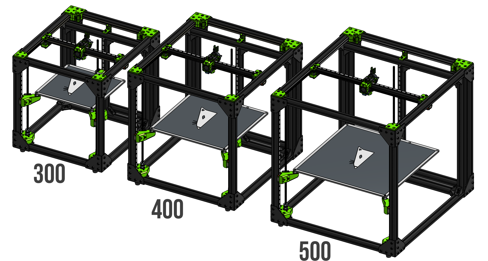
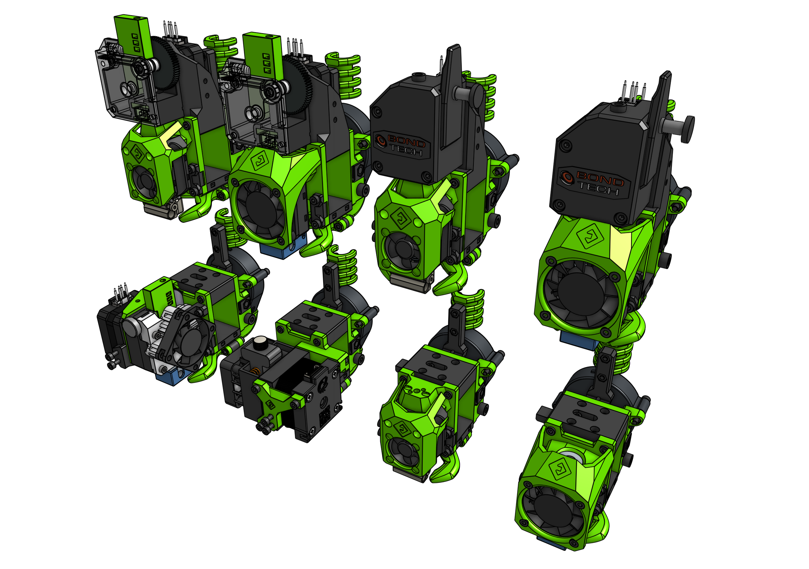
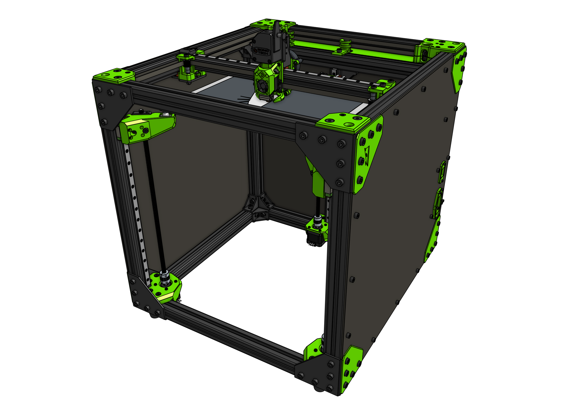
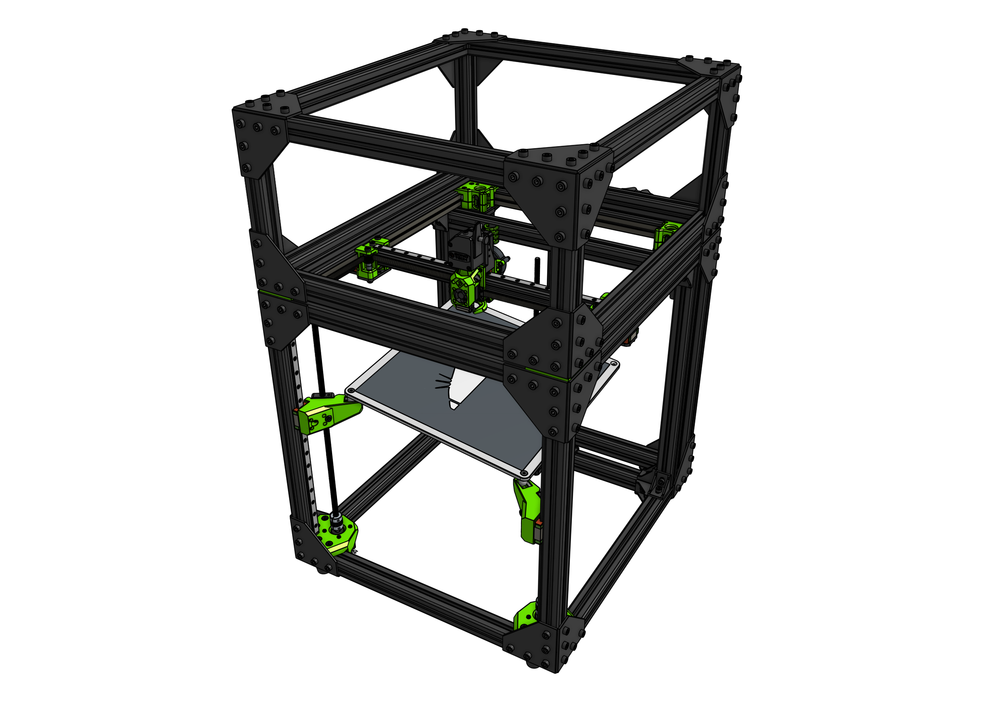
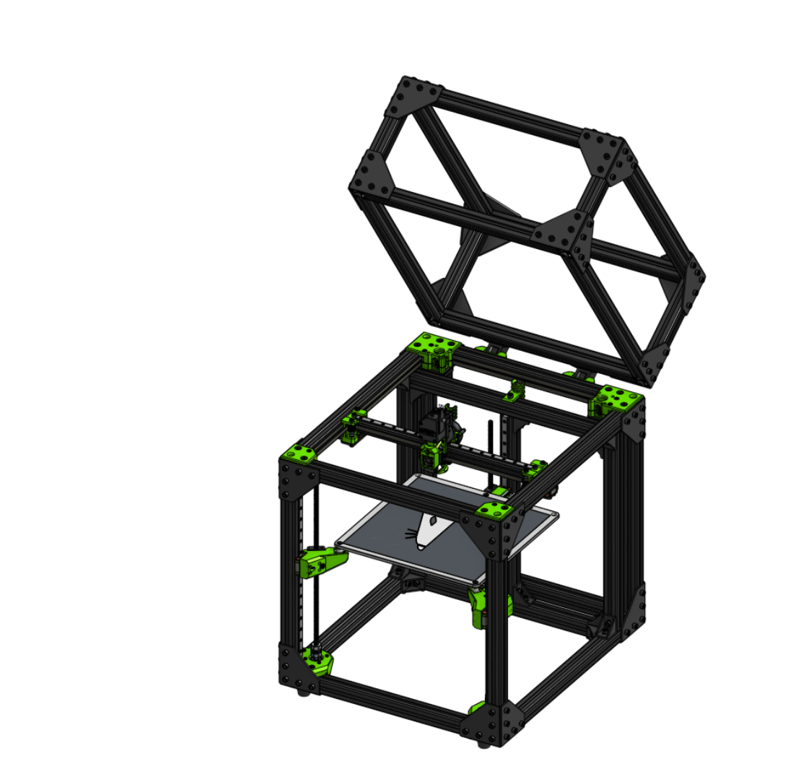
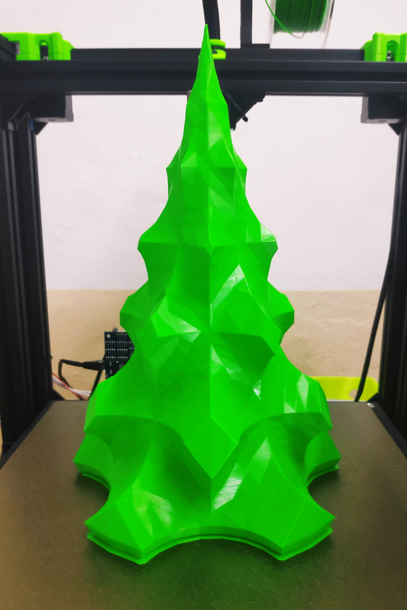

# V-core 3

The V-Core 3 is a premium DIY kit for a CoreXY 3D Printer with no compromises. 

<iframe width="1000" height="600" src="https://www.youtube.com/embed/Op-3dwBHY4c" frameborder="0" allow="accelerometer; autoplay; clipboard-write; encrypted-media; gyroscope; picture-in-picture" allowfullscreen></iframe>

[Order Now!](https://www.ratrig.com/3d-printing-cnc/3d-printer-kits/complete-kits/v-core3configurable.html){: .md-button .md-button--primary target=_blank }

This kit is the culmination of Rat Rig's accumulated years of experience designing, producing and distributing DIY 3D Printer kits worldwide. Originally introduced in 2017, the V-Core went through several iterations and multiple variants over time, through a process of continuously seeking user feedback to drive product development. The lessons learned over the years allowed us to understand what works and what doesn't, what features are most valued by users, and what choices ensure both quality and affordability. We've distilled all this knowledge into the V-Core 3, which was designed in partnership with Pawel Kucmus, a long time member of our on-line community and one of the most prolific contributors to the V-Core platform. 

&nbsp;

<iframe width="1000" height="600" src="https://www.youtube.com/embed/ZB7LUQIaYpM" frameborder="0" allow="accelerometer; autoplay; clipboard-write; encrypted-media; gyroscope; picture-in-picture" allowfullscreen></iframe>

[Order Now!](https://www.ratrig.com/3d-printing-cnc/3d-printer-kits/complete-kits/v-core3configurable.html){: .md-button .md-button--primary target=_blank }

## Precision

- [x] 3 Point Kinematic Bed

<iframe width="1000" height="600" src="https://www.youtube.com/embed/bgkK7Fez8VU" frameborder="0" allow="accelerometer; autoplay; clipboard-write; encrypted-media; gyroscope; picture-in-picture" allowfullscreen></iframe>

&nbsp;

- [x] 6mm Cast Tooling Plate for Print bed

&nbsp;
 

&nbsp;

- [x] Immaculate CoreXY Belt Path

&nbsp;

- [x] All movement guided by MGN12 Linear Rails

&nbsp;

&nbsp;

- [x] Doubled Z resolution with TR8x4 Lead Screws instead of TR8x8

&nbsp;

## Robustness

While previous V-Core versions, like many other printers on the market, relied solely on 20 Series profiles, the V-Core 3 is fully built on a 30 Series aluminium frame. From screws and nuts to brackets and plates, everything is bigger, stronger and tougher.  

- [x] Frame made with 30x30mm T-Slot aluminium with a beautiful black anodization
- [x] 4mm thick anodized aluminium plates
- [x] 9mm Belts
- [x] Weight of Z drivetrain and bed is distributed across the Z motor mounts - not on the motors themselves

## Customization

- [x] Available both as a complete kit and a configurable kit (for those who want to select their own electronics)
- [x] Configurable options include LDO motors, Keenovo Heatpads, and multiple controller board options (from Duet3D, SKR, etc) 
- [x] 3 build volumes available as standard option: 300, 400 and 500 mm3

| V-Core 3 variant| Build Volume (mm)|External dimensions (mm)*|  
| ----------- | ------------------- | --------------------- |
| 300  |  300x300x300  | 518x583x560 |
| 400  |  400x400x400  | 618x683x660 |
| 500  |  500x500x500  | 718x783x760 |

*Z height corresponds to frame height. Your extruder head will protrude slightly above the frame, and you will need extra Z room for filament feed. For the frame version with a top chamber, add 245mm to the given Z height.

&nbsp;

- [x] Full End Stop solutions
- [x] EVA 2 Carriage System provides mounts for most popular extruder and hot end choices on the market (Bowden, BMG, Titan, Aero, Hemera, and more to come!)
- [x] Shipping with EVA 2.2.1

!!! tip end "What is EVA?"
    EVA is an independently developed and maintained project that aims to be a single platform for many extrusion types.

    **Copperhead** and **Bondtech LGX** support incoming!

    Note that not all print head types (due to their physical dimensions) can achieve the full 300x300 print space.

EVA 2 is the next iteration of the EVA platform with which V-Core 3 is fully compatible. Most vivid improvements since the last iteration is the improved front belt clamp feature (no more zip ties!), improved contribution system, more ease of assembly, modular X endstop system, dedicated cable paths and shrouds (for ascetics).

Read more about EVA on: [:octicons-octoface-16: EVA 2 Documentation](https://main.eva-3d.page/)

## Support

- [x] Fully comprehensive step by step build guide (Both static and video)

- [x] Fully comprehensive wiring and electronics guide for multiple controller boards
- [x] Support configuration files for several firmware choices (Reprap, Marlin, Klipper)
- [x] Join our <a href="https://www.facebook.com/groups/ratrig3dprintercommunity" target="_blank">Facebook 3D Printer Community</a> to connect with other V-Core users, share builds, knowledge, mods, and stay posted on all V-Core 3 developments.

## Safety

- [x] Wiring design includes multiple cable management parts, for cable clamping, guiding and strain relief
- [x] Custom Keenovo Heat Pad with pre-wired 157ºC Thermal Fuse for extra safety (Optional)

- [x] For 220V Heat pad users, grounding point at the bed and fully isolated bed from the rest of the printer means that the printer frame is never conducting any dangerous voltages. 

## Convenience

- [x] Designed for a far easier and quicker assembly than previous versions

- [x] Separate chamber for electronics ensures heat insulation, short motor cable path, easy access to all wiring, and a very clean installation.

*Panel for mounting electronics is not supplied, user is meant to source it locally. A 4mm thick polycarbonate sheet is suggested. Mounting screws and nuts are included as part of the base kit. DXF files with size, shape and hole patterns for the panels are provided on the project documentation.

- [x] Easily and fully enclosable frame

*Enclosing panels are not supplied, user is meant to source them locally. A 4mm thick polycarbonate sheet is suggested. Mounting screws and nuts for these panels are NOT included as part of the base kit. DXF files with size, shape and hole patterns for the panels are provided on the project documentation.

- [x] Optional top lid

- [x] IEC and LAN ports

## Modding

The V-Core 3 is the perfect printer for advanced users who like to tweak and tinker with their machine:

- [x] Fully open-source design, with downloadable 3D models and part libraries freely available
- [x] Frame is built on a modular platform of T-Slot and V-Slot profiles, which allow for endless possibilites when it comes to mounting all types of parts 
- [x] Vast catalog of stand-alone parts available for infinite upgradeability: screws, nuts, connectors, brackets, pulleys, belts, electronics, etc 

## Sample Prints

## Acknowledgments

As an Open-source project, the V-Core 3 design is the result of prolonged brainstorming, testing, and collaboration between many active members of the international 3D Printer Community, who shared their knowledge and experience with our design team. As such, the machine inevitably draws inspiration from and builds upon many existing design elements that have been developed, shared, tested, modded, and iterated by the community at large. The nature of the open-source movement makes it often difficult to trace back where each idea was originally generated, making it hard to produce a comprehensive list of acknowledgments. Nevertheless, below we list a few names and projects that we would like to credit for their direct or indirect contribution/inspiration to the V-Core 3 platform (in no particular order):

- Hypercube by Tech2c
- Voron
- BLV
- Jubilee
- Simon Davie
- João Barros
- Detlev Rackow
- Márcio Pereira
- Eduardo Oliveira
- Mikkel Schmidt
- Harald Wagener
- Antonios Antzoulatos
- Lukas Sinitsch
- Tomasz Paluszkiewicz

## Licence

This work is licensed under a <a rel="license" href="http://creativecommons.org/licenses/by-sa/4.0/">Creative Commons Attribution-ShareAlike 4.0 International License</a>
