# V-Core 3

The V-Core 3 is a premium DIY kit for a CoreXY 3D Printer with no compromises. 

<iframe width="1000" height="600" src="https://www.youtube.com/embed/Op-3dwBHY4c" frameborder="0" allow="accelerometer; autoplay; clipboard-write; encrypted-media; gyroscope; picture-in-picture" allowfullscreen></iframe>

[Order Now!](https://www.ratrig.com/3d-printing-cnc/3d-printer-kits/complete-kits/v-core3configurable.html){: .md-button .md-button--primary target=_blank }

This kit is the culmination of Rat Rig's accumulated years of experience designing, producing and distributing DIY 3D Printer kits worldwide. Originally introduced in 2017, the V-Core went through several iterations and multiple variants over time, through a process of continuously seeking user feedback to drive product development. The lessons learned over the years allowed us to understand what works and what doesn't, what features are most valued by users, and what choices ensure both quality and affordability. We've distilled all this knowledge into the V-Core 3, which was designed in partnership with Pawel Kucmus, a long time member of our on-line community and one of the most prolific contributors to the V-Core platform. 

&nbsp;

<iframe width="1000" height="600" src="https://www.youtube.com/embed/ZB7LUQIaYpM" frameborder="0" allow="accelerometer; autoplay; clipboard-write; encrypted-media; gyroscope; picture-in-picture" allowfullscreen></iframe><iframe width="1000" height="600" src="https://www.youtube.com/embed/5kbxjMeS5jU" title="YouTube video player" frameborder="0" allow="accelerometer; autoplay; clipboard-write; encrypted-media; gyroscope; picture-in-picture" allowfullscreen></iframe>

[Order Now!](https://www.ratrig.com/3d-printing-cnc/3d-printer-kits/complete-kits/v-core3configurable.html){: .md-button .md-button--primary target=_blank }

## Precision

- [x] 3 Point Kinematic Bed

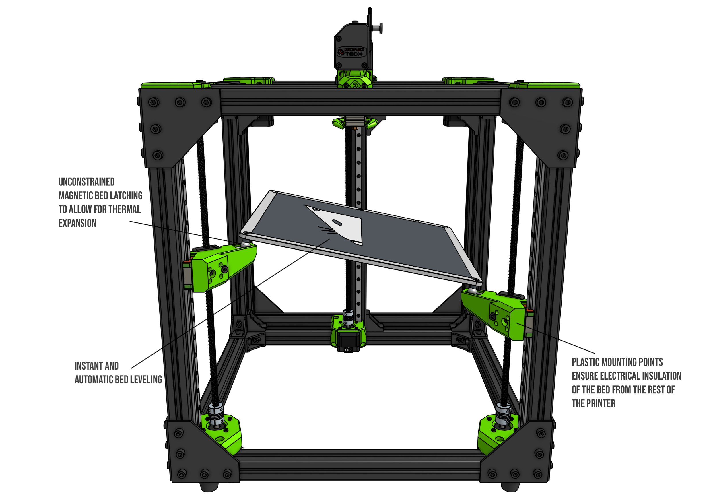

Bed plates expand as they heat up. If their mounting points are unmovable, the bed will have no room to expand to the sides, and it will be forced to bow (either upwards or downwards). The V-Core 3 bed plate is not rigidly connected to the machine's frame. Instead, 3 steel balls connected to the bed sit on low friction dowel pins. The pins act like a pair of rails for the steel balls, guiding their movement as the bed expands and ensuring that only radial movement is possible - there's zero margin for lateral movement. This means that while your plate is firmly in place, it can still remain perfectly flat as it expands.

Since the bed only has 3 mounting points, which are connected to 3 independently driven Z motors, bed-levelling is exclusively determined by motor position and can be done 100% electronically - simple and instantaneous.

<iframe width="1000" height="600" src="https://www.youtube.com/embed/bgkK7Fez8VU" frameborder="0" allow="accelerometer; autoplay; clipboard-write; encrypted-media; gyroscope; picture-in-picture" allowfullscreen></iframe>

&nbsp;

- [x] 6mm Cast Tooling Plate for Print bed

&nbsp;
 

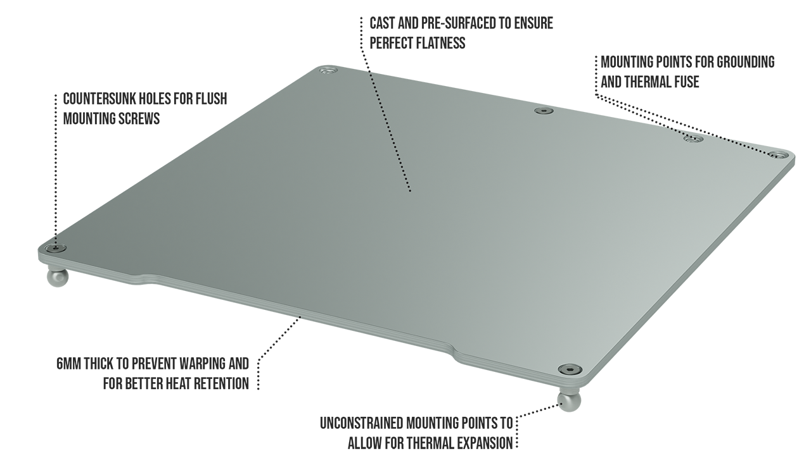

&nbsp;

- [x] Immaculate CoreXY Belt Path

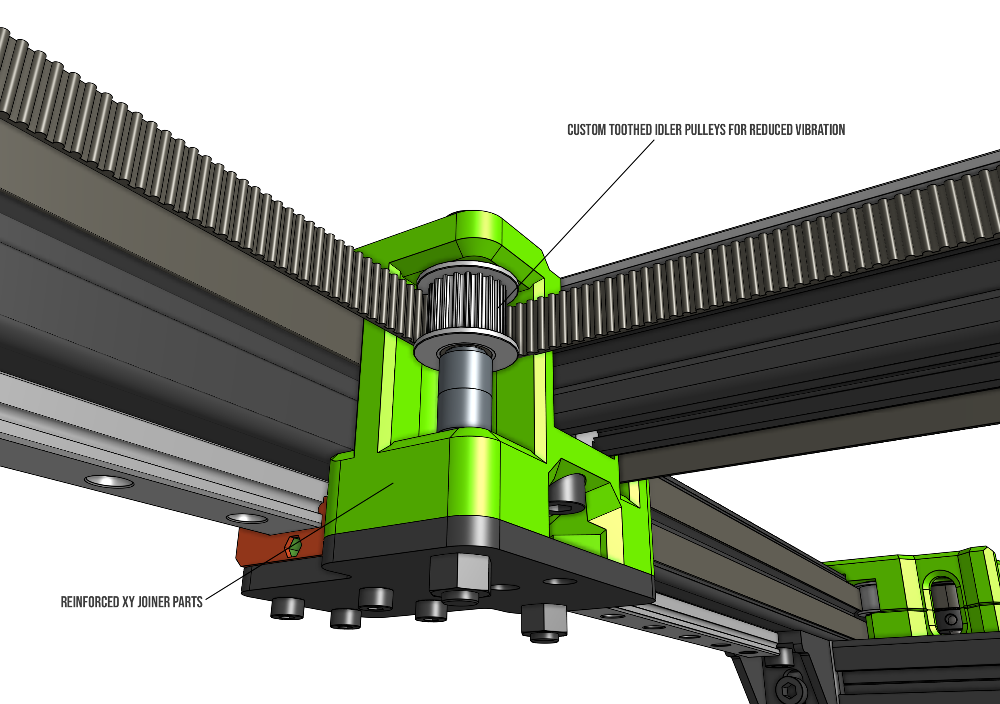

&nbsp;

- [x] All movement guided by MGN12 Linear Rails

&nbsp;

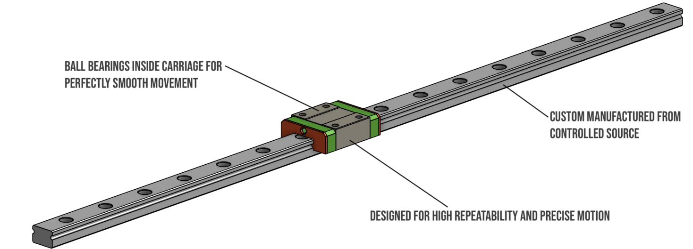

&nbsp;

- [x] Doubled Z resolution with TR8x4 Lead Screws instead of TR8x8

&nbsp;

The V-Core 3 uses 3 lead screws to drive the Z axis of the machine. They move the bed down in small increments, at the end of each complete layer. The Z axis moves very slowly, so speed is not the priority - precision and resolution are. 
The V-Core 3 uses TR8X4mm lead screws instead of the TR8x8mm used in previous machines, effectively halving the pitch of the lead screw - this means that each rotation of the motor, now moves the bed half as much.
This both doubles the Z resolution of your layers and multiplies the holding torque - always helpful when you're moving such a heavy bed, especially on the larger variants.

## Robustness

While previous V-Core versions, like many other printers on the market, relied solely on 20 Series profiles, the V-Core 3 is fully built on a 30 Series aluminium frame. From screws and nuts to brackets and plates, everything is bigger, stronger and tougher.  

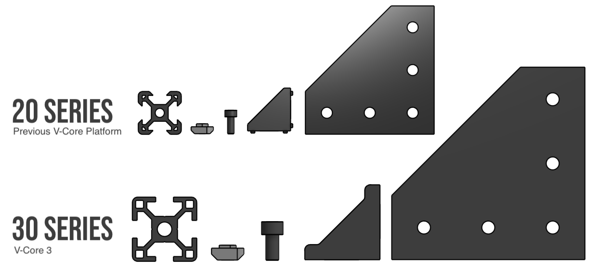

- [x] Frame made with 30x30mm T-Slot aluminium with a beautiful black anodization
- [x] 4mm thick anodized aluminium plates
- [x] 9mm Belts
- [x] Weight of Z drivetrain and bed is distributed across the Z motor mounts - not on the motors themselves

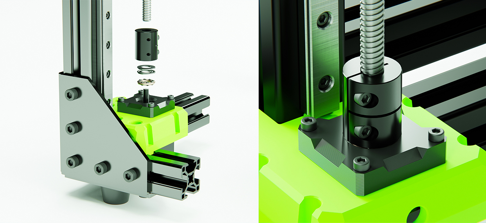

## Customization

- [x] Available both as a complete kit and a configurable kit (for those who want to select their own electronics)
- [x] Configurable options include LDO motors, Keenovo Heatpads, and multiple controller board options (from Duet3D, SKR, etc) 
- [x] 3 build volumes available as standard option: 300, 400 and 500 mm3
- [x] Full End Stop solutions
- [x] EVA 2 Carriage System provides mounts for most popular extruder and hot end choices on the market (Bowden, BMG, Titan, Aero, Hemera, and more to come!)
- [x] Shipping with EVA 2.4.2 (since Feb 2022)

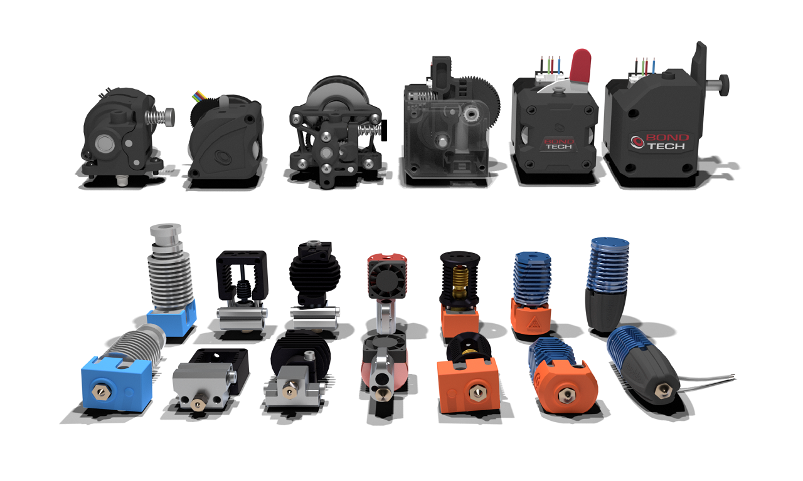

!!! tip end "What is EVA?"
    EVA is an independently developed and maintained project that aims to be a single platform for many extrusion types.

    Note that not all print head types (due to their physical dimensions) can achieve the full 300x300 print space.

EVA 2 is the next iteration of the EVA platform with which V-Core 3 is fully compatible. Most vivid improvements since the last iteration is the improved front belt clamp feature (no more zip ties!), improved contribution system, more ease of assembly, modular X endstop system, dedicated cable paths and shrouds (for ascetics).

Read more about EVA on: [EVA 2 Documentation](https://main.eva-3d.page/)

## Support

- [x] Fully comprehensive step by step build guide (Both static and video)

- [x] Fully comprehensive wiring and electronics guide for multiple controller boards
- [x] Support configuration files for several firmware choices (Reprap, Marlin, Klipper)
- [x] Join our <a href="https://www.facebook.com/groups/ratrig3dprintercommunity" target="_blank">Facebook 3D Printer Community</a> to connect with other V-Core users, share builds, knowledge, mods, and stay posted on all V-Core 3 developments.

## Safety

- [x] Wiring design includes multiple cable management parts, for cable clamping, guiding and strain relief
- [x] Custom Keenovo Heat Pad with pre-wired 157ºC Thermal Fuse for extra safety (Optional). The wiring comes out of the pad slightly off-center, so it's neatly guided to the back of the machine without interfering with the bed mounting point at the back.

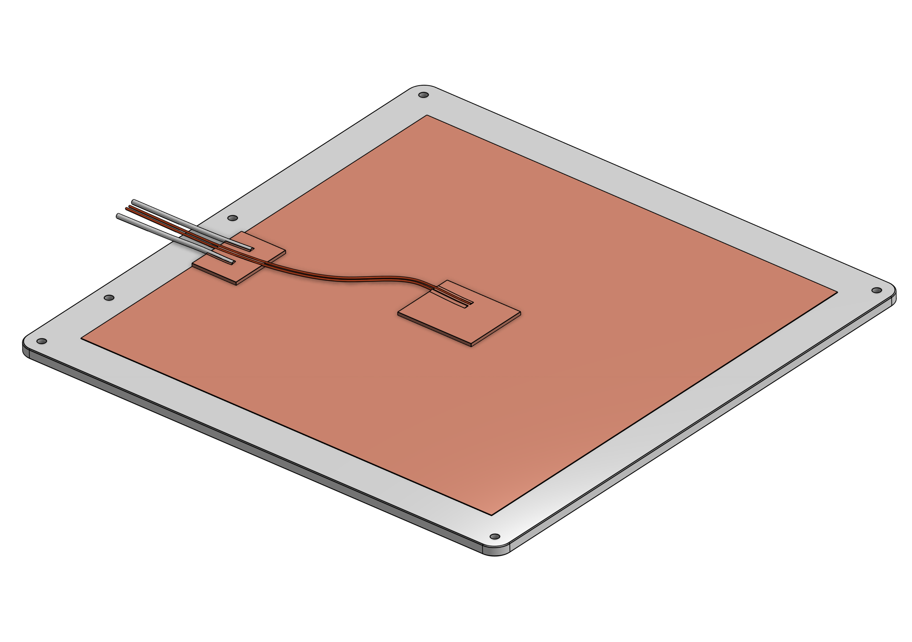

- [x] For 220V Heat pad users, grounding point at the bed and fully isolated bed from the rest of the printer means that the printer frame is never conducting any dangerous voltages. 

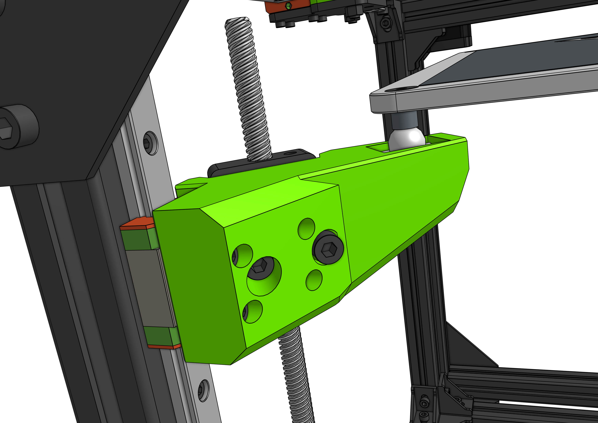

## Convenience

- [x] Designed for a far easier and quicker assembly than previous versions

- [x] Separate chamber for electronics ensures heat insulation, short motor cable path, easy access to all wiring, and a very clean installation.

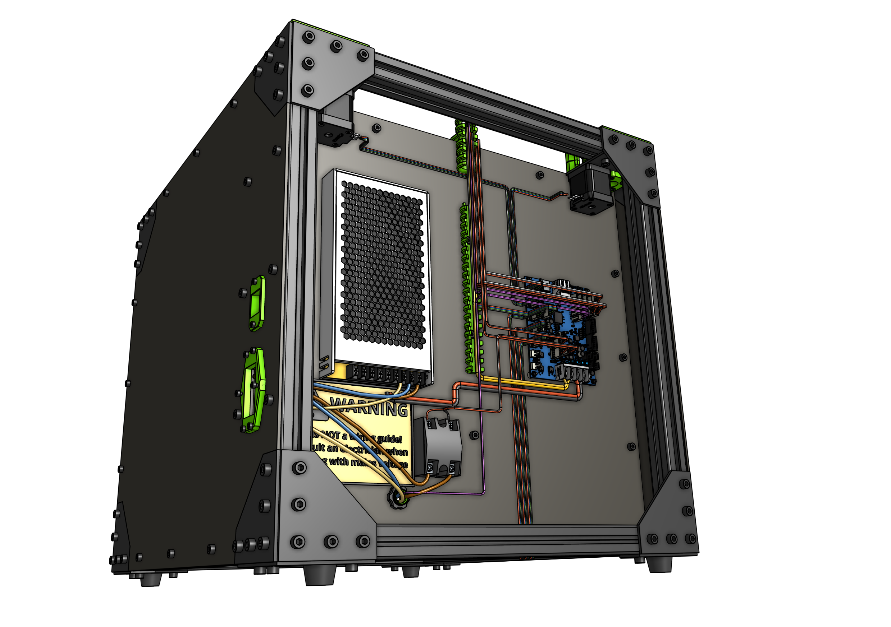

*Panel for mounting electronics is not supplied, user is meant to source it locally. A 4mm thick polycarbonate sheet is suggested. Mounting screws and nuts are included as part of the base kit. DXF files with size, shape and hole patterns for the panels are provided on the project documentation.

:warning: Electronics Panel should not be thicker than 4mm, otherwise it will not fit in the available space.

- [x] IEC and LAN ports

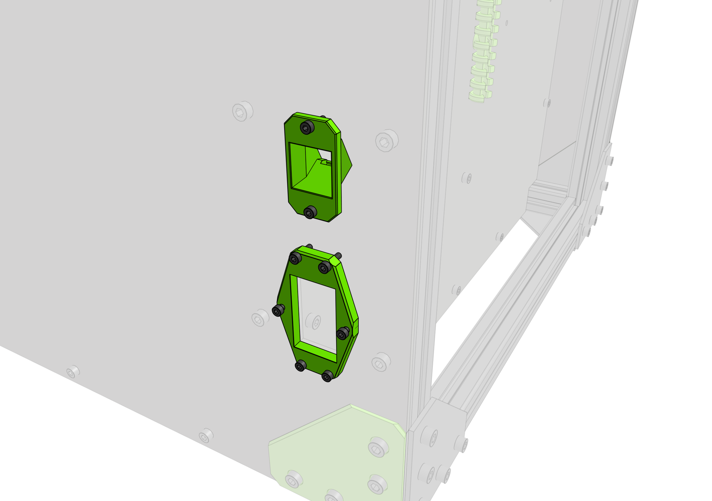

## Fully Enclosable
### Enclosure Kit

The V-Core 3 was designed from the ground up with full enclosing in mind, with no need for an external enclosure. The design ensures that all motors and electronics are safely placed outside the printing chamber, so they are shielded from high temperatures, and no machine elements protrude from the frame, ensuring that the frame can be directly covered with panels from all sides.

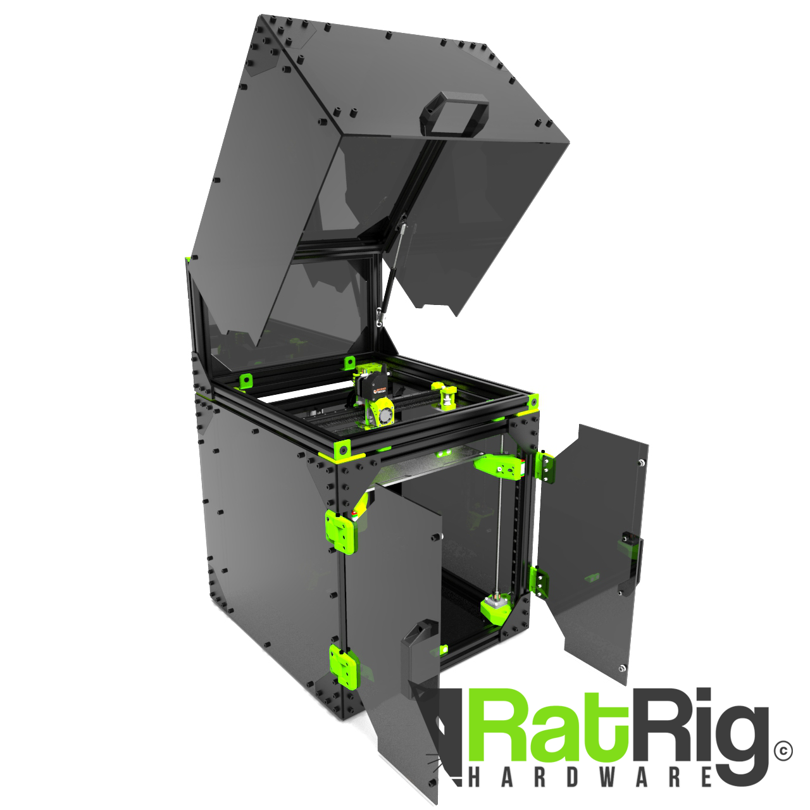

* The enclosure kit does not contain the enclosure panels, these must be sourced locally. DXF and STEP files are available on the project documentation for all panels on all machine sizes.

[Order Now!](https://www.ratrig.com/v-core-3-enclosure-kit.html){: .md-button .md-button--primary target=_blank }

### In-Lid Spool Holder

Our in-house spool holder was also designed with the V-Core 3 enclosure in mind. It can be securely installed inside the V-Core 3 lid, allowing your spool to stay tidy and neat.

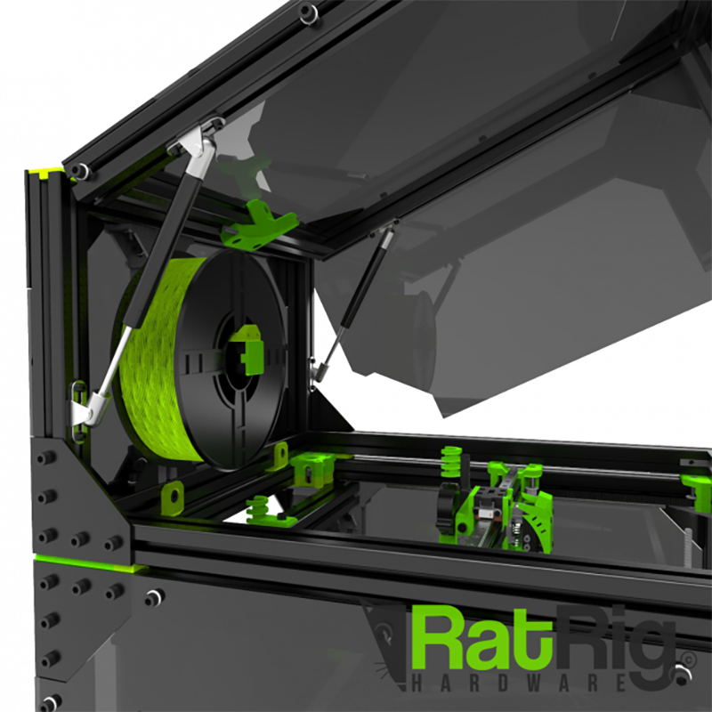

[Order Now!](https://www.ratrig.com/rat-rig-spool-holder-v2-0-kit-extrusion-based.html){: .md-button .md-button--primary target=_blank }

## Modding

The V-Core 3 is the perfect printer for advanced users who like to tweak and tinker with their machine:

- [x] Fully open-source design, with downloadable 3D models and part libraries freely available
- [x] Frame is built on a modular platform of T-Slot and V-Slot profiles, which allow for endless possibilites when it comes to mounting all types of parts 
- [x] Vast catalog of stand-alone parts available for infinite upgradeability: screws, nuts, connectors, brackets, pulleys, belts, electronics, etc
- [x] For some inspiration, check out the <a href="https://photos.app.goo.gl/kfevYUU9f1RaxHxh9" target="_blank">V-Core 3 Gallery</a> with builds from users worldwide

## Dimensions
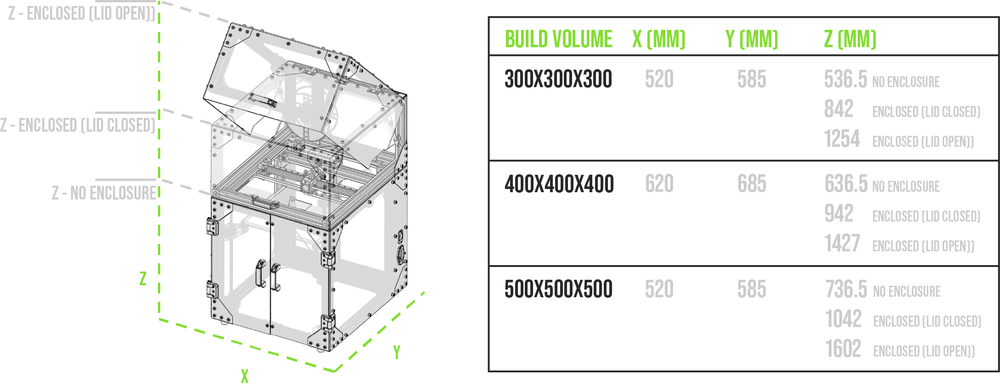

## Sample Prints / Parts
These images showcase 3D prints produced by V-Core 3 machines belonging to members of our community. Clicking any image will open the full size version.

{ target=_blank }
{ target=_blank }
{ target=_blank }
{ target=_blank }

## Acknowledgments

As an Open-source project, the V-Core 3 design is the result of prolonged brainstorming, testing, and collaboration between many active members of the international 3D Printer Community, who shared their knowledge and experience with our design team. As such, the machine inevitably draws inspiration from and builds upon many existing design elements that have been developed, shared, tested, modded, and iterated by the community at large. The nature of the open-source movement makes it often difficult to trace back where each idea was originally generated, making it hard to produce a comprehensive list of acknowledgments. Nevertheless, below we list a few names and projects that we would like to credit for their direct or indirect contribution/inspiration to the V-Core 3 platform (in no particular order):

- Hypercube by Tech2c
- Voron
- BLV
- Jubilee
- Simon Davie
- João Barros
- Detlev Rackow
- Márcio Pereira
- Eduardo Oliveira
- Mikkel Schmidt
- Harald Wagener
- Antonios Antzoulatos
- Lukas Sinitsch
- Tomasz Paluszkiewicz

## License

This work is licensed under a <a rel="license" href="https://creativecommons.org/licenses/by-nc-sa/4.0/">Creative Commons Attribution-NonCommercial-ShareAlike 4.0 International</a>

You may share, remix and mod the design. By default, you may not use the design and its derivatives for commercial purposes, but if you request a commercial license from us, we may (and most likely will) grant you one, as long as we deem your goals are aligned with the best interests of the project and its users. 

The spirit of the project is to remove barriers to innovation and focus on pushing the technology, working as a collective, inspiring each other and experimenting with new ideas. We are happy to foster a rich ecosystem of suppliers and services that empowers users by offering them more options and alternatives.

[:material-link-box-variant: Request a Commercial License](https://forms.gle/g8QWjqNmytDGKZLj7){: .md-button .md-button--primary target=_blank }
